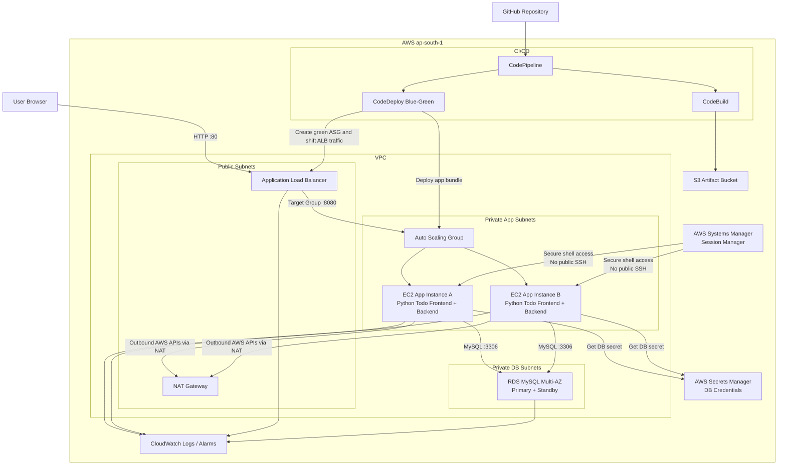
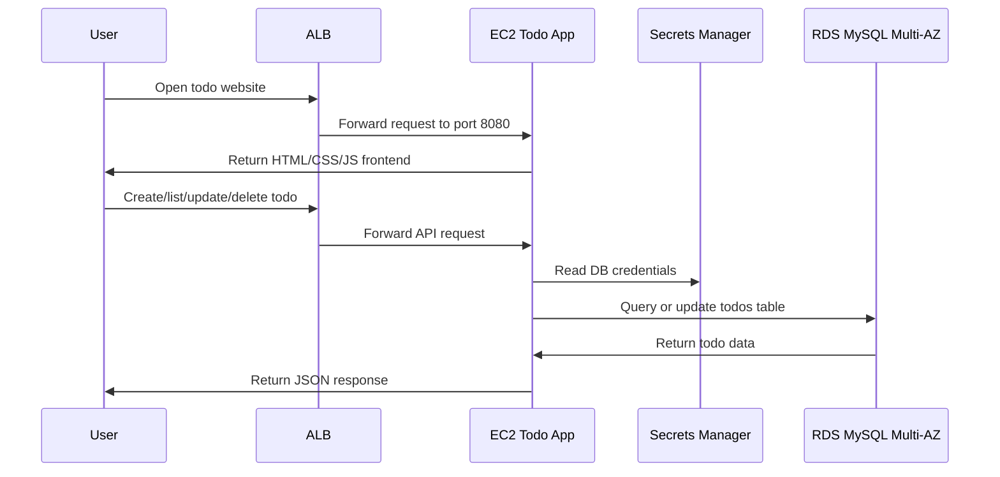
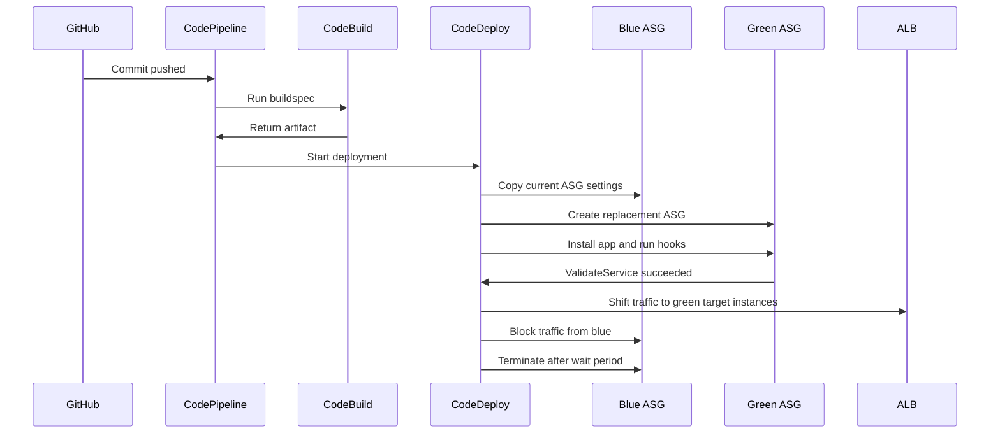

# Architecture Diagram

```mermaid
flowchart TB
    user["User Browser"]
    github["GitHub Repository"]

    subgraph aws["AWS ap-south-1"]
        subgraph vpc["VPC"]
            subgraph public["Public Subnets"]
                alb["Application Load Balancer"]
                nat["NAT Gateway"]
            end

            subgraph private_app["Private App Subnets"]
                asg["Auto Scaling Group"]
                ec2a["EC2 App Instance A<br/>Python Todo Frontend + Backend"]
                ec2b["EC2 App Instance B<br/>Python Todo Frontend + Backend"]
            end

            subgraph private_db["Private DB Subnets"]
                rds["RDS MySQL Multi-AZ<br/>Primary + Standby"]
            end
        end

        secrets["AWS Secrets Manager<br/>DB Credentials"]
        s3["S3 Artifact Bucket"]

        subgraph cicd["CI/CD"]
            pipeline["CodePipeline"]
            codebuild["CodeBuild"]
            codedeploy["CodeDeploy Blue-Green"]
        end

        ssm["AWS Systems Manager<br/>Session Manager"]
        cw["CloudWatch Logs / Alarms"]
    end

    user -->|"HTTP :80"| alb
    alb -->|"Target Group :8080"| asg
    asg --> ec2a
    asg --> ec2b

    ec2a -->|"MySQL :3306"| rds
    ec2b -->|"MySQL :3306"| rds

    ec2a -->|"Get DB secret"| secrets
    ec2b -->|"Get DB secret"| secrets
    ec2a -->|"Outbound AWS APIs via NAT"| nat
    ec2b -->|"Outbound AWS APIs via NAT"| nat

    github --> pipeline
    pipeline --> codebuild
    codebuild --> s3
    pipeline --> codedeploy
    codedeploy -->|"Deploy app bundle"| asg
    codedeploy -->|"Create green ASG and shift ALB traffic"| alb

    ssm -->|"Secure shell access<br/>No public SSH"| ec2a
    ssm -->|"Secure shell access<br/>No public SSH"| ec2b

    ec2a --> cw
    ec2b --> cw
    alb --> cw
    rds --> cw
```

## Request Flow

```mermaid
sequenceDiagram
    participant User
    participant ALB
    participant EC2 as EC2 Todo App
    participant Secrets as Secrets Manager
    participant RDS as RDS MySQL Multi-AZ

    User->>ALB: Open todo website
    ALB->>EC2: Forward request to port 8080
    EC2->>User: Return HTML/CSS/JS frontend
    User->>ALB: Create/list/update/delete todo
    ALB->>EC2: Forward API request
    EC2->>Secrets: Read DB credentials
    EC2->>RDS: Query or update todos table
    RDS->>EC2: Return todo data
    EC2->>User: Return JSON response
```

## Blue-Green Deployment Flow

```mermaid
sequenceDiagram
    participant GitHub
    participant Pipeline as CodePipeline
    participant Build as CodeBuild
    participant Deploy as CodeDeploy
    participant Blue as Blue ASG
    participant Green as Green ASG
    participant ALB

    GitHub->>Pipeline: Commit pushed
    Pipeline->>Build: Run buildspec
    Build->>Pipeline: Return artifact
    Pipeline->>Deploy: Start deployment
    Deploy->>Blue: Copy current ASG settings
    Deploy->>Green: Create replacement ASG
    Deploy->>Green: Install app and run hooks
    Green->>Deploy: ValidateService succeeded
    Deploy->>ALB: Shift traffic to green target instances
    Deploy->>Blue: Block traffic from blue
    Deploy->>Blue: Terminate after wait period
```
